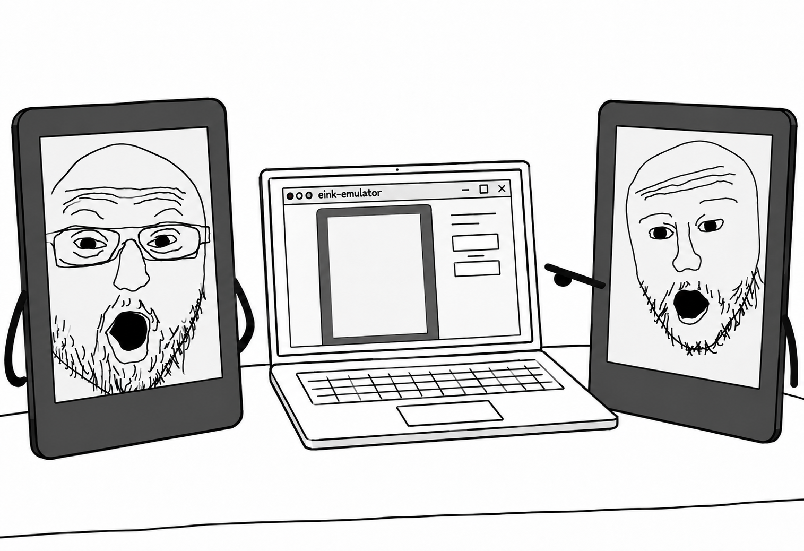

<div align="center">
  <h1>E-ink emulator</h1>
  <i>Run virtual Kindle and Kobo e-readers in QEMU!</i>
  
</div>


Run Kindle and Kobo firmware in QEMU with a persistent disk for each emulated device.

No firmware, device dumps, account data, or physical-device identity values are distributed here. This project is not affiliated with Amazon or Rakuten
Kobo.

## Quick start

Clone and inspect the supported models:

```sh
git clone git@github.com:katadelos/eink-emulator.git
cd eink-emulator
./eink models
./eink firmware
```

The first command that needs QEMU initializes the QEMU checkout and fetches
its pinned SLIRP fallback. QEMU's unrelated firmware and test submodules are
not needed.

Use `./eink firmware` to find the files needed for your model. Some Kindles
also need device identity fields when you create an instance. For example,
to create a Voyage:

```sh
./eink create my-reader --model kindle-voyage \
  --idme serial='<value>' \
  --idme mac='<value>' \
  --idme mfg='<value>' \
  --idme pcbsn='<value>' \
  --idme bootmode='<value>' \
  --idme postmode='<value>'

./eink run my-reader
```

The Scribes use built-in virtual identities and require a hardware profile.
Import a recovery package, then create an instance:

```sh
./eink import /path/to/update.bin --model kindle-scribe-1
./eink create my-scribe --model kindle-scribe-1 --profile dvt
./eink run my-scribe
```

Kobo devices do not use identity fields:

```sh
./eink create my-kobo --model kobo-touch
./eink run my-kobo

./eink create my-mini --model kobo-mini
./eink run my-mini

./eink create my-forma --model kobo-forma --sideloaded
./eink run my-forma

./eink create my-elipsa --model kobo-elipsa-2e --sideloaded
./eink run my-elipsa
```

`create` builds QEMU if needed, prepares a shared base image, and adds a
small writable disk for the instance.

## Everyday commands

```text
./eink models                 List supported models
./eink firmware               Show required firmware files
./eink import FILE --model M  Import a supported recovery package
./eink create NAME --model M  Create a persistent instance
./eink run NAME               Launch an instance
./eink qemu -- ARGS           Use a raw QEMU machine
./eink list                   List instances
./eink images                 List base and instance disks
./eink build                  Build the QEMU fork
```

Serial uses the launching terminal. Add `--serial-socket` to send it to the
instance's Unix socket and log file, or `--qmp-socket` to enable QMP control.
Use `--headless` to disable the display, or `--vnc ENDPOINT` for VNC.
`--ssh-port PORT` changes SSH forwarding; Scribe 1 and 2 use telnet instead,
with `--telnet-port PORT` to change its default port of 2323.
Arguments after `--` are passed directly to QEMU.

## Using a raw QEMU machine

For kernel or bootloader work, pass QEMU options directly through `eink qemu`:

```sh
# Bootloader development
./eink qemu -- \
  -machine imx6sl-wario,idme-serial='<value>',idme-mac='<value>' \
  -m 512M \
  -bios path/to/u-boot.bin \
  -serial mon:stdio \
  -no-reboot

# Direct kernel boot
./eink qemu -- \
  -machine imx6sl-wario,idme-serial='<value>',idme-mac='<value>' \
  -m 512M \
  -kernel path/to/uImage \
  -append '<kernel command line>' \
  -serial mon:stdio \
  -no-reboot

# Eanab bootloader development
./eink qemu -- \
  -machine imx6sl-eanab,idme-serial='<value>',idme-mac='<value>' \
  -m 512M \
  -bios path/to/u-boot.bin \
  -serial mon:stdio \
  -no-reboot
```

These commands run QEMU directly. Supply any disk images and machine
properties yourself; `eink qemu` does not create or load a saved instance.

## Taking a screenshot

Use QEMU's monitor to capture the emulated framebuffer directly. While a
machine is running, press `Ctrl-A C` to switch from its serial console to the
monitor, then write a PNG to an absolute host path:

```text
(qemu) screendump /tmp/eink-screen.png -f png
```

Press `Ctrl-A C` again to return to the serial console. `screendump` captures
guest pixels without window decorations, cursor state, display scaling, or
other desktop content.

## Supported models

| Full name | Abbreviation | Board name | Notes |
| --- | --- | --- | --- |
| Kindle 4 | K4 | Tequila | |
| Kindle Touch | K5 | Whitney | |
| Kindle Paperwhite 1 | PW1 | Celeste | |
| Kindle Paperwhite 2 | PW2 | Pinot | |
| Kindle Basic (2014) | KT2 | Bourbon | |
| Kindle Voyage | KV | Icewine | |
| Kindle Paperwhite 3 | PW3 | Muscat | |
| Kindle Basic 2 (2016) | KT3 | Eanab | |
| [Kindle Oasis 1](docs/oasis.md) | KOA1 | Whisky / Duet | |
| [Kindle Oasis 2](docs/oasis.md) | KOA2 | Cognac / Zelda | |
| Kindle Paperwhite 4 | PW4 | Moonshine | |
| [KT4](docs/kt4.md) | KT4 | Jaeger | |
| [KOA3](docs/koa3.md) | KOA3 | Stinger | |
| Kindle Basic 5 (2022) | KT5 | Cava | |
| [Kindle Scribe 1](docs/scribe-1.md) | KS1 | Barolo | Experimental |
| Kindle Basic 6 (2024) | KT6 | Rossini | |
| [Kindle Colorsoft](docs/colorsoft.md) | CS | Sangria Color | |
| [Kindle Paperwhite 6](docs/paperwhite-6.md) | PW6 / PW12 | Sangria | |
| [Kindle Scribe 2](docs/scribe-2.md) | KS2 | Pisco | Experimental |
| [Kindle Scribe 3](docs/scribe-3.md) | KS3 | Paloma | Experimental |
| [Kindle Scribe Colorsoft](docs/scribe-colorsoft.md) | KSC | Calvados | Experimental |
| Kobo Mini | N705 | E50610 | |
| Kobo Touch | N905 | E60610 | |
| [Kobo Forma](docs/kobo-forma.md) | Forma | E80K02 | Stock UI, offline sideloaded mode |
| [Kobo Elipsa 2E](docs/kobo-elipsa-2e.md) | N605 | EA0T00 | Stock UI, offline sideloaded mode |

Additional documentation covers [firmware setup](docs/firmware.md),
[guest compatibility changes](docs/guest-overrides.md),
[QMP workflows](docs/qmp.md), and [storage layout](docs/storage.md).

## Host requirements

- Python 3.10 or newer
- a C compiler and the standard QEMU build dependencies
- Ninja
- `mke2fs`, `e2fsck`, `tune2fs`, and `debugfs` from e2fsprogs for image creation
- `kindletool` when importing supported Kindle recovery packages

On macOS, Homebrew's `e2fsprogs` package supplies the filesystem tools. QEMU's
SLIRP dependency is built from its pinned subproject when it is not installed
on the host.
